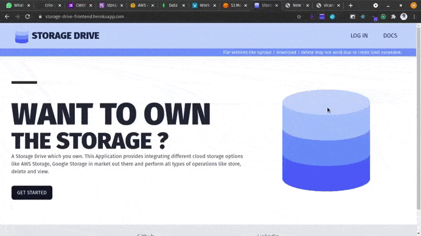
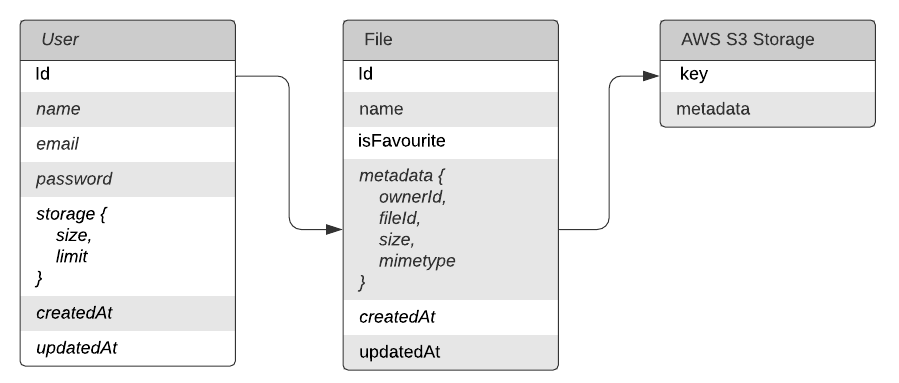

<h1 align="center">
   
 
   
  Storage Drive
   

</h1>

<h5 align="center">
	A Storage Drive which you can own.
</h5>

	<strong>
		<a href="https://storage-drive-frontend.herokuapp.com/">Website</a>
		•
		<a href="https://github.com/Crio-Winter-of-Doing-2021/VICARA-T8/wiki">Docs</a>
		•
		<a href="https://drive.google.com/file/d/1pCPZybgSJNcLAKiaXgzdxP50_2Q0cESO/view?usp=sharing">Demo Video</a>
	</strong>

	
  	

A Storage Drive which you own. This Application provides integrating different cloud storage options like AWS Storage, Google Storage in market out there and perform all types of operations like store, delete and view.

## Storage Drive for Enterprises

Storage Drive for digital assets which can be adopted by enterprises and integrated with their other systems. Existing services such as Google Drive or DropBox don’t provide this flexibility and also increase the storage cost. Build the basic functionality like authentication, uploads, downloads, viewing and deleting files on a user friendly interface. Making it scalable and implementing additional features like favourites, recent uploads, and link based sharing. Implemented API based upload/download that enables customers to integrate it with their workflows and other systems.

### TechStack :

  
      

### Architecture

- Services: Frontend and Backend are hosted differenlty and are communicating thorugh REST services.
- Authentication Flow : Auth 2.0 Access/Refresh Token Implementation.
- Data Streams for file Upload / Download : Data streams are used for both upload and download. DataStream used to reduce load on server for both upload and download.StreamSaver JS used for reduce load on client side downloading.Since our application deals large number of concurrent users with high volume of data and want the most reliability from your server, the best option is to not store intermediate files on the Node.js server at all. Instead, we push the same files to the server as soon as we receive them. The file server can be a cloud storage service such as AWS S3.To make this happen, streams are the optimal way of handling the incoming file data. Read <a href="https://github.com/Crio-Winter-of-Doing-2021/VICARA-T8/wiki">this</a>.
- Database : Mapping of data from Mongo Cloud DB to AWS S3.

  

### UI / UX

  

<!-- GIF NEEDED -->

### Features

- Login / Register .
- Upload files.
- Add / Remove to and from favourites.
- Delete file.
- Download file.
- Public Shareable Link.
- Filtering / Sorting of files.
- Storage update card.

### CodeStyle

- Mobile responsive code.
- Object oriented style followed.
- Dependency Injection used with separation of code in controller / service / database layers.

### DB Schema

  

### Installation

To setup a development environment.

- Follow the <a href="https://github.com/Crio-Winter-of-Doing-2021/VICARA-T8/wiki/Installation-Instructions">Wiki</a>.

### Contributors:

- [Rajat Kumar](https://github.com/991rajat)
- [Manas Uniyal](https://www.github.com/ManasUniyal)

### License

The MIT License 2021.
